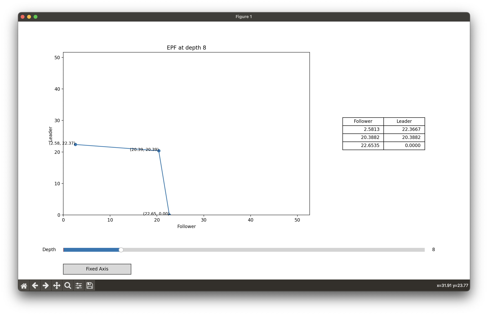

# EPF Solver for Two Players General Sum Repeated Games

## 1. Define a Game
1. **Create a root node** (and indicate the maximum depth and discount factor if the game is iterated).
2. **Create all remaining nodes** for the game tree. For all leaf nodes, indicate their payoff in the form **(follower payoff, leader payoff)**.
3. **Connect the game nodes** by calling `add_child` on parents.
4. **Set ALL game nodes** (including the root itself) to be the root by calling the function `set_root` on the root.

## 2. Visualize the Game
Call the `draw_EPF` method on the root node and you'll see the following window:



## 3. Interact with the Slider
Interact with the slider to see the EPF of the game at different depths. The slider sometimes takes more than 10 seconds to load. If it doesn't respond for a long time, try switching to another screen and then coming back. This trick works all the time, at least on my side.

## 4. Change Viewing Options
Click the button below to change the viewing option (dynamic/static axes).

## Some Issues
1. **Naive Dynamic Programming**: As I used a very naive dynamic programming approach to compute the EPF, my code cannot handle super deep game trees now. (Will fix later.) Currently, for this prisoners' dilemma, I can set the `max_depth` to up to 150.
2. **Code Correctness**: I have not tested the correctness of my code. I have only used the prisoners' dilemma to run the program. Will fix later.

## Update logs:
1. **25/03/2025**: I fixed the bug that a point will be duplicated when it lies on the threshold. I also correct the algorithm so that the payoff of leaf nodes is calculated correctly.

# APS_SEFCE: Convex Hull Operators for Stackelberg Games

This repository provides Python implementations of two iterative solvers for computing convex hulls of achievable payoffs in Stackelberg games:
- `solver_R.py`: Implements the R-operator (no LPs), using pure profile enumeration and geometric clipping.
- `solver_oracle.py`: Implements the B-operator (LP-based), using support-function refinement and block-structured LPs.

Both solvers visualize the evolution of the convex hull across iterations and support custom game trees.

## Requirements
- Python 3.8+
- NumPy
- Matplotlib
- SciPy
- pycddlib (for `solver_oracle.py` only)

Install dependencies:
```bash
pip install numpy matplotlib scipy pycddlib
```

## Usage

### 1. R-Operator Solver (`solver_R.py`)
This script computes the fixed point of the R-operator for a specified game tree and initial set of continuation values.

**Run the solver:**
```bash
python3 solver_R.py
```

**What it does:**
- Defines a toy game tree (customizable in code)
- Computes punishment values and one-shot deviations
- Iterates the R-operator until convergence
- Plots the convex hull evolution and final result

**Key outputs:**
- Console logs: progress, number of profiles, vertices per iteration
- Plots: hull overlays for each iteration, final fixed point
- Prints final vertices of $R^*(W)$

### 2. B-Operator Solver (`solver_oracle.py`)
This script computes the fixed point of the B-operator using LP oracles and adaptive support-function refinement.

**Run the solver:**
```bash
python3 solver_oracle.py
```

**What it does:**
- Defines a toy game tree (customizable in code)
- Computes punishment values and one-shot deviations
- Iterates the B-operator with support-function refinement
- Plots the convex hull overlays for each iteration and the final result

**Key outputs:**
- Console logs: progress, Hausdorff distances, vertices per iteration
- Plots: hull overlays for each iteration, initial and final sets
- Prints final vertices of $B^*(W)$

## Customization
- To change the game tree, edit the node and game definitions near the bottom of each script.
- To adjust convergence criteria, modify `max_iter`, `tol`, or `eps` parameters in the main function calls.
- For larger games, expect longer runtimes due to combinatorial profile enumeration (R-operator) or LP solving (B-operator).

## Visualization
- Both solvers produce Matplotlib plots showing the evolution of the convex hull.
- The initial set $W_0$ is shown in dashed red; iterates fade in color; the final fixed point is highlighted.

## Troubleshooting
- If you encounter errors with `pycddlib`, ensure it is installed and compatible with your Python version.
- For performance profiling, add logging or timing instrumentation as needed.

## References
- The algorithms implemented are based on convex hull methods for Stackelberg extensive-form games.
- For details, see the comments in each script and relevant literature on Stackelberg equilibrium computation.

## License
MIT License.
